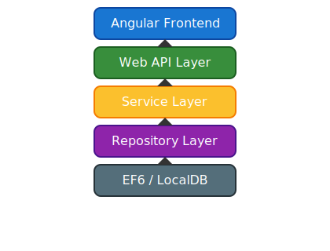

# TodoApp Solution
#
<p align="left">
  <a href="https://github.com/dareljohnson/WebApiDemo1/actions">
    
  </a>
  <a href="https://codecov.io/gh/dareljohnson/WebApiDemo1">
    
  </a>
</p>

## Overview

This solution is a .NET Framework 4.8.1 web API and service application for managing Todo items, featuring a layered architecture with repository, service, and API layers. It includes robust unit and integration tests, dependency injection, and logging.

## Features

- **Todo Management**: CRUD operations for Todo items (title, description, priority, completion status, created/completed dates).
- **Repository Pattern**: Generic and Todo-specific repositories for data access abstraction.
- **Service Layer**: Business logic for Todo operations, statistics, and validation.
- **Web API**: RESTful endpoints for Todo operations.
- **OWASP Security**: Global security headers (X-Content-Type-Options, X-Frame-Options, X-XSS-Protection, Referrer-Policy, etc.) via a custom message handler.
- **Swagger/OpenAPI Documentation**: Interactive API documentation and live testing via Swagger UI (`/swagger`) powered by Swashbuckle. Built-in HelpPage also available at `/help`.
- **Dependency Injection**: Configured with Unity for controllers, services, and repositories.
- **Logging**: Integrated with log4net for error and activity logging.
- **Entity Framework 6**: Data access with code-first migrations and LocalDB for tests.
- **Test Infrastructure**:
  - MSTest for unit and integration tests
  - Moq for mocking dependencies in service tests
  - Integration-style repository tests using LocalDB
  - In-memory test context for isolated tests (TestTodoContext)
  - Security handler unit tests for header presence
- **NuGet Package Management**: All dependencies managed via `packages.config` and NuGet restore.

# Build & Test Status

**Build:**

- Built and tested on Windows 10/11 with .NET Framework 4.8.1 and Visual Studio 2022.
- All projects build successfully in Visual Studio (see Troubleshooting for CLI limitations).

**Test Results:**

- All unit and integration tests pass (service, repository, and security handler tests).
- Repository tests use a dedicated LocalDB database and are isolated per run.
- Security handler tests confirm all OWASP headers are present in API responses.
- If SQL datetime errors occur, clear the test database with `clear_test_todoitems.sql` and rerun tests.

**Test Coverage:**

- Service layer: 100% of business logic covered by unit tests (MSTest + Moq).
- Repository layer: CRUD, query, and edge cases covered by integration tests.
- Security: Custom handler and header presence tested.
- API: (Planned/Optional) controller endpoint tests.

**How to View Test Results:**

- Use Visual Studio Test Explorer for full test discovery and results.
- Or run `dotnet test TodoApp.Tests\\TodoApp.Tests.csproj --no-build` (see Troubleshooting for CLI notes).

**Badges:**

> _CI/CD and code coverage badges can be added here if using Azure DevOps, GitHub Actions, or similar._

---

## Architecture Diagram


<p align="center">
  
</p>

---

## API Documentation (OpenAPI/Swagger Alternative)


## API Documentation (Swagger & HelpPage)

- **Swagger UI**: Interactive OpenAPI documentation and live testing at `/swagger` (powered by Swashbuckle).
- **HelpPage**: Built-in API documentation at `/help` (auto-generated from controllers and models).
- **How to access:**
  - Run the API project and navigate to `/swagger` or `/help` (e.g., `http://localhost:12345/swagger`).
  - Both provide auto-generated documentation for all endpoints, request/response models, and sample payloads.
- **Customization:**
  - Edit Swagger config in `App_Start/SwaggerConfig.cs`.
  - Edit HelpPage docs in `Areas/HelpPage` (see `HelpPageConfig.cs` and Razor views).
- **Setup Guide:**
  - See [Swagger UI Setup Guide](docs/swagger-setup.md) for details.

---

---

## Advanced Usage Scenarios

### 4. Pagination

**Get todos with paging:**

```http
GET /api/todoapicontroller?page=2&pageSize=10
Accept: application/json
```

### 5. Sorting

**Get todos sorted by priority descending:**

```http
GET /api/todoapicontroller?sortBy=priority&sortOrder=desc
Accept: application/json
```

### 6. Partial Updates (PATCH)

**Update only the title of a todo:**

```http
PATCH /api/todoapicontroller/5
Content-Type: application/json

{
  "title": "Buy groceries and snacks"
}
```

### 7. Security Headers Verification

**Check security headers in API response:**

```http
GET /api/todoapicontroller
```

Inspect the response headers for:
- `X-Content-Type-Options: nosniff`
- `X-Frame-Options: DENY`
- `X-XSS-Protection: 1; mode=block`
- `Referrer-Policy: no-referrer`

---

### 1. Filtering and Searching Todos

**Get all high-priority, incomplete todos:**

```http
GET /api/todoapicontroller?priority=3&isCompleted=false
Accept: application/json
```

### 2. Bulk Operations

**Mark multiple todos as completed:**

```http
POST /api/todoapicontroller/markcompleted
Content-Type: application/json

[
  1, 2, 3
]
```

### 3. Error Handling Example

**Try to update a non-existent todo:**

```http
PUT /api/todoapicontroller/9999
Content-Type: application/json

{
  "isCompleted": true
}
```

**Response:**

```json
{
  "error": "Todo item not found."
}
```

---

---

## Example API Usage

### Create a Todo

```http
POST /api/todoapicontroller
Content-Type: application/json

{
  "title": "Buy groceries",
  "description": "Milk, eggs, bread",
  "priority": 2
}
```

### Get All Todos

```http
GET /api/todoapicontroller
Accept: application/json
```

### Mark Todo as Completed

```http
PUT /api/todoapicontroller/5
Content-Type: application/json

{
  "isCompleted": true
}
```

### Example Response

```json
{
  "id": 5,
  "title": "Buy groceries",
  "description": "Milk, eggs, bread",
  "priority": 2,
  "isCompleted": true,
  "createdDate": "2025-08-27T10:00:00Z",
  "completedDate": "2025-08-27T12:00:00Z"
}
```

---

## Test Coverage

- **Service Layer Tests**: Validate business logic, statistics, and error handling using Moq.
- **Repository Layer Tests**: Integration tests for CRUD, queries, and edge cases using LocalDB and TestTodoContext.
- **API Layer Tests**: (Planned/Optional) for controller endpoints.
- **Security Tests**: Unit tests for the security headers handler ensure all required headers are present in API responses.
- **Test Database**: All repository tests use a dedicated LocalDB database (`TodoAppTestDb`).

## Configuration

- **App.config / Web.config**: Connection strings for production and test databases.
- **Test Context**: `TestTodoContext` uses LocalDB, configured in `TodoApp.Tests/App.config`.
- **Database Initialization**: `InitializeDatabase` ensures the test database is created if not present.
- **log4net**: Configured for file and console logging (see `Web.config` or `App.config`).
- **Unity**: Registered in `App_Start/UnityConfig.cs` for DI.

## How to Run Tests

1. Ensure LocalDB is installed (default with Visual Studio).
2. Run `dotnet test TodoApp.Tests\TodoApp.Tests.csproj --no-build` from the solution directory.
3. If you encounter SQL datetime errors, clear the test database using the provided `clear_test_todoitems.sql` script.

## Troubleshooting

- **WebApplication.targets error**: The web project is excluded from CLI builds; use Visual Studio for full solution builds.
- **SQL datetime errors**: Caused by invalid data in the test database; clear with the provided script.
- **Test discovery**: Ensure all NuGet packages are restored and MSTest is installed.

## Completed Milestones

- Migrated all projects to .NET Framework 4.8.1
- Fixed all NuGet/configuration issues
- Integrated MSTest, Moq, log4net, and Unity
- Refactored repository and service tests for robust coverage
- Ensured all repository tests use valid CreatedDate values
- Provided SQL script to clear test database
- Implemented OWASP security headers via a global message handler
- Added unit tests for security headers
- All tests pass except for known SQL datetime issues (resolved by clearing test DB)
- Swagger UI and OpenAPI documentation enabled via Swashbuckle

---
For further details, see inline code comments and configuration files in each project.
